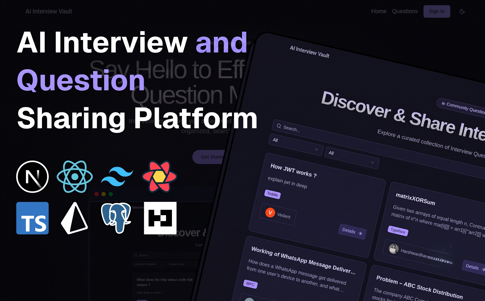
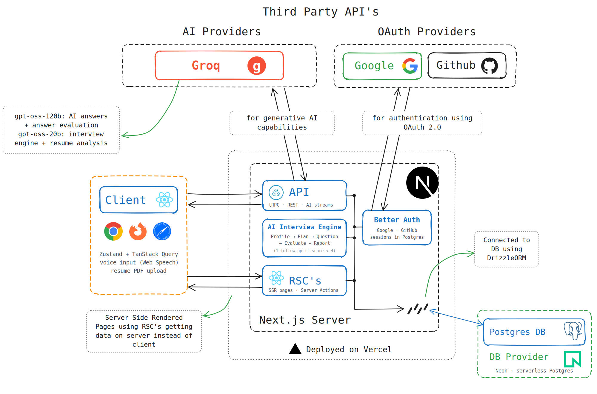

<div align="center">
  <h1>Interview Vault</h1>
  <strong>The ultimate platform for collaborative interview prep and AI-powered mock interviews.</strong>
  <br/>
  <br/>
  <a href="https://interview-vault-ai.vercel.app/"></a>
  <a href="https://nextjs.org/"></a>
  <a href="https://www.typescriptlang.org/"></a>
  <a href="https://tailwindcss.com/"></a>
  <a href="https://postgresql.org/"></a>
</div>

<br/>

InterviewVault is a comprehensive, modern platform built to help developers master technical interviews. Not only can you store, share, and organize community interview questions, but you can also run **highly realistic, dynamic AI Mock Interviews** tailored directly to your resume and target job descriptions.

👉 **Live Demo:** [https://interview-vault-ai.vercel.app/](https://interview-vault-ai.vercel.app/)

<div align="center">
  
</div>

---

## Key Features

### AI Mock Interview Engine (New!)
* **Smart Resume Parsing**: Upload your resume and Job Description, and our AI will dynamically identify core skills, projects, and gaps to build a completely personalized 5-question interview plan.
* **Dynamic Follow-ups**: Answers are graded in real-time (1-5 scale). If you stumble on a concept, the AI instantly pivots to ask a highly-targeted follow-up question to probe your understanding (capped at exactly 7 questions to respect your time).
* **Instant Scorecards**: When the interview finishes, the system utilizes Groq LPUs for lightning-fast inference to generate an immediate, comprehensive scorecard featuring a 0-100% final score, a topic-by-topic breakdown, and an actionable narrative summary.

### Community Question Vault
* **Question Management**: Create, edit, and organize real interview questions.
* **Filter & Search**: Quickly sort questions by specific companies (e.g., Google, Amazon) or job roles.
* **AI-Powered Solutions**: Generate intelligent reference answers for difficult technical questions.
* **Collaborative Answers**: Community members can submit and upvote the best solutions.

## Architecture

<div align="center">
  
</div>

## Tech Stack

* **Framework**: Next.js 15 (App Router)
* **Language**: TypeScript
* **Database**: PostgreSQL paired with Drizzle ORM
* **Authentication**: Better Auth (Google & GitHub SSO)
* **AI Integration**: AI SDK paired with Groq LPUs (`@ai-sdk/groq`) for instant, ultra-fast inference
* **UI/Styling**: Tailwind CSS, shadcn/ui, framer-motion

## Getting Started

### Prerequisites
* Node.js 18+
* PostgreSQL database instance
* `pnpm` package manager (recommended)
* API Keys (Groq API Key for AI Features)

### Installation

1. **Clone the repository:**
```bash
git clone https://github.com/Prithviraj-Dhavan/InterviewVault.git
cd InterviewVault
```

2. **Install dependencies:**
```bash
pnpm install
```

3. **Environment Setup:**
```bash
cp .env.example .env
```
*Be sure to configure your Database URL, Auth secrets, and your `GROQ_API_KEY` inside `.env`.*

4. **Initialize the Database:**
```bash
npx drizzle-kit push
```

5. **Start the Development Server:**
```bash
pnpm dev
```
Open [http://localhost:3000](http://localhost:3000) to view the application!

## Database Schema Overview
The application is structured via a robust relational PostgreSQL schema:
* **Users & Auth**: Secure sessions managed by Better Auth.
* **Questions & Answers**: Core community question tracking and crowdsourced answers.
* **Interview Sessions**: Tracks the state of active mock interviews.
* **Candidate Profiles & Plans**: Stores the AI's analysis of the user's resume vs JD.
* **Interview Questions & Evaluations**: Records the live transcript and real-time grading of the mock interview.
* **Interview Reports**: Stores the final 0-100% calculated scores and summaries.

## Contributing
1. Fork the repository
2. Create your feature branch (`git checkout -b feature/amazing-feature`)
3. Commit your changes (`git commit -m 'feat: add amazing feature'`)
4. Push to the branch (`git push origin feature/amazing-feature`)
5. Open a Pull Request

---
<div align="center">
  <i>Built to make technical interviews effortless.</i>
</div>
